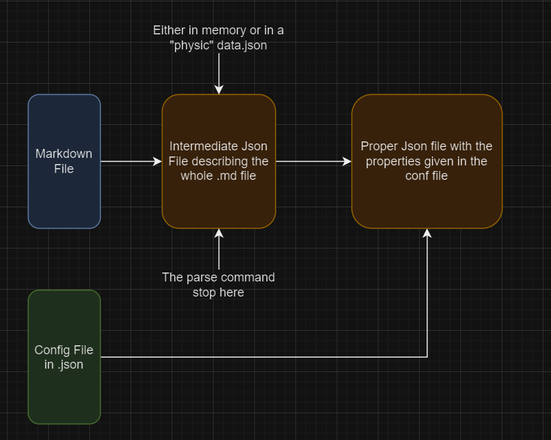

<h3 align="center">
  
</h3>

<div align="center">
<a href="https://actions-badge.atrox.dev/Eric-Philippe/JuliaMarkdownJoy/goto?ref=main"></a>


</div>

<div align="center">
    <h1>Julia Markdown Joy</h1>
</div>

<strong>Julia Markdown Joy</strong> is a Julia package that provides a set of tools to help you write your markdown documents and then convert those human-readable documents into machine-readable code. (Json, HTML, etc.)

## Introduction

The idea behind this package is from my [Portfolio](https://github.com/Eric-Philippe/portfolio) where I wanted to simplify the process of inserting my projects and photos albumbs into the website. I wanted to be able to insert my projecrs without having to write a single line of code, and maybe forget to update somewhere else. I wanted to be able to write my projects in a markdown file and.

I first try to make a first version in Python, but way too specific to my needs. So I decided to make a more general version in Julia.

#### Why Julia?

Because It's been a long time since I was trying to make a project in Julia. I wanted to learn more about the language and its ecosystem.
It also a good language in terms of performance and I wanted to see how it would perform in this kind of project compared to Python.

## Getting Started

Download the repository or clone it :

```bash
git clone https://github.com/Eric-Philippe/JuliaMarkdownJoy.git
```

In order to execute this project, Julia is required.

```bash
curl -fsSL https://install.julialang.org | sh
```

Then, you need to install the dependencies.

```bash
julia --project=. -e 'using Pkg; Pkg.instantiate()'
```

## Usage

### CLI

```bash
julia --project=. src/run.jl
```

At the moment, the CLI only supports the following commands:

| Command           | Description                                                        | Status             |
| ----------------- | ------------------------------------------------------------------ | ------------------ |
| `help`            | Display the help message                                           | W.I.P              |
| `parse`           | Parse a markdown file to an intermediate JSON representation       | ✅                 |
| `extract`         | Extract specific fields from a Markdown file to a proper JSON file | ✅                 |
| `test-dead-links` | Test all the links in a markdown file                              | ✅                 |
| `convert`         | Convert a Markdown file to [HTML, YAML, JSON]                      | W.I.P (HTML Ready) |

#### Parse command

```bash
julia --project=. src/run.jl parse --file <path_to_markdown_file>.md --output <path_to_output_file>.json
```

The extract command will parse the markdown file and output a JSON file that looks like this :

```json
{
  "_content": [
    {
      "type": "h1",
      "content": "Hello World"
    },
    {
      "type": "p",
      "content": "simple paragraph"
    },
    {
      "type": "code_block",
      "content": ["python", "print(\"Julia\")\nprint(\"Markdown\")"]
    },
    {
      "type": "code_block",
      "content": ["unknown", "println(\"Julia\")\nprintln(\"Markdown\")"]
    },
    {
      "type": "img",
      "content": ["alt content", "url"]
    },
    {
      "type": "link",
      "content": ["alt content", "url"]
    },
    {
      "type": "quote",
      "content": "quote content"
    },
    {
      "type": "table_headers",
      "content": ["header1", "header2"]
    },
    {
      "type": "table_row",
      "content": ["cell1_row1", "cell2_row1"]
    },
    ...
  ]
}
```

##### Flags

| Flag      | Description                        | Required | Alias | format  |
| --------- | ---------------------------------- | -------- | ----- | ------- |
| `-input`  | Path to the markdown file to parse | ✅       | `-i`  | `.md`   |
| `-output` | Path to the output file            | ❌       | `-o`  | `.json` |

> The input can also be a directory, in this case, the program will parse all the markdown files in the directory **except** the ones that start with an underscore `_`.

#### Extract command

```bash
julia --project=. src/run.jl extract -input <path_to_markdown_file>.md -conf config.json --output <path_to_output_file>.json
```

The extract command will parse the markdown file and output a json file only with the fields specified in the config file.

##### Config file

The config file allow you to pick the properties you want, where, and with what format

```json
{
  "fields": [
    {
      "find_property_": "title",
      "after_a_": "title",
      "named_": ["Titre", "Title"]
    },
    {
      "find_property_": "content",
      "after_a_": "title",
      "named_": [
        "Contenu",
        "Contenu du projet",
        "Description",
        "Description du projet"
      ],
      "take_everything_after_": true
    },
    {
      "find_property_": "previewImg",
      "after_a_": "image",
      "named_": [
        "Image",
        "Image de prévisualisation",
        "Image de preview",
        "Preview",
        "Preview image"
      ]
    }
  ]
}
```

We can easily read the config file as a human text, take the first field :

I want to **find the property** `title` **after** a `title` **named** `Titre` or `Title`

So, at the end if the field is well in the markdown file, the output will be :

```json
{
  "title": "My title"
  ...
}
```

> I plan to add a flag to specify to make a pre-check to see if the field is in the markdown file, otherwise, depending on the flag, it will throw an error or (as it is now) put a "NOT_FOUND" string in the output.

##### Flags

| Flag      | Description                        | Required | Alias | format  |
| --------- | ---------------------------------- | -------- | ----- | ------- |
| `-input`  | Path to the markdown file to parse | ✅       | `-i`  | `.md`   |
| `-output` | Path to the output file            | ❌       | `-o`  | `.json` |
| `-conf`   | Path to the config file            | ✅       | `-c`  | `.json` |

> The input can also be a directory, in this case, the program will parse all the markdown files in the directory **except** the ones that start with an underscore `_`.

##### Facultative attributes

You can put the following attributes in the config file for each field :

- `take_everything_after_` : If true, the program will take everything after the field, and parse it to pure html. (Useful for the content of a project for example)

- `format_` : The format of the field. [uppercase, lowercase...]

## How it works



## Roadmap

- [x] Parse markdown file to JSON
- [x] Extract specific fields from a Markdown file to a proper JSON file
- [x] Test all the links in a markdown file
- [ ] Convert a Markdown file to [HTML, YAML, JSON]

## Suggestions

This project at this time only aims to be a tool to help me with my portfolio. But if you have any suggestions, feel free to open an issue or a pull request, I'd be happy to make it better for your usage too.
